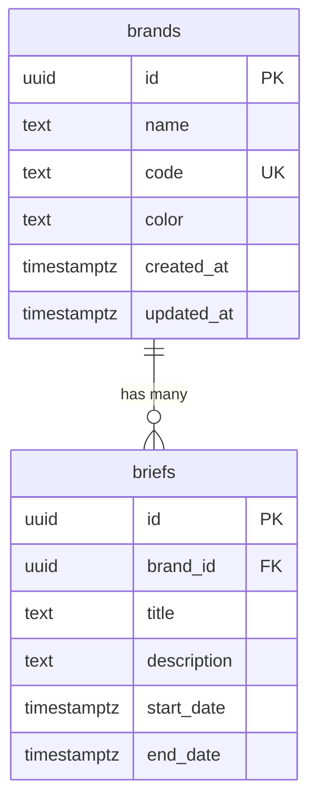

# Marketing Calendar SaaS Database Schema Documentation

This document provides a comprehensive overview of the database schema for the Marketing Calendar SaaS application. It describes all tables, their relationships, and the purpose of each field.

## Table of Contents

1. [Users](#users)
2. [Resources](#resources)
3. [Campaigns](#campaigns)
4. [Briefs](#briefs)
5. [Entity Relationship Diagram](#entity-relationship-diagram)
6. [Brands Table](#brands-table)

## Users

The `users` table stores information about application users.

| Column | Type | Description |
|--------|------|-------------|
| id | UUID | Primary key, unique identifier for the user |
| name | TEXT | User's full name |
| email | TEXT | User's email address (unique) |
| role | TEXT | User's role: 'admin', 'manager', or 'contributor' |
| created_at | TIMESTAMP WITH TIME ZONE | When the user was created |
| avatar_url | TEXT | URL to the user's avatar image (optional) |

## Resources

The `resources` table stores information about resources that can be assigned to briefs.

| Column | Type | Description |
|--------|------|-------------|
| id | UUID | Primary key, unique identifier for the resource |
| name | TEXT | Resource name |
| type | TEXT | Resource type: 'internal', 'agency', or 'freelancer' |
| created_at | TIMESTAMP WITH TIME ZONE | When the resource was created |

## Campaigns

The `campaigns` table stores information about marketing campaigns, which can include tradeshows, product launches, seasonal promotions, digital campaigns, events, etc.

| Column | Type | Description |
|--------|------|-------------|
| id | UUID | Primary key, unique identifier for the campaign |
| name | TEXT | Campaign name |
| campaign_type | TEXT | Type of campaign: 'tradeshow', 'product_launch', 'seasonal_promotion', 'digital_campaign', 'event', or 'other' |
| start_date | DATE | When the campaign starts |
| end_date | DATE | When the campaign ends |
| location | TEXT | Physical location of the campaign (optional) |
| description | TEXT | Description of the campaign (optional) |
| created_at | TIMESTAMP WITH TIME ZONE | When the campaign was created |
| updated_at | TIMESTAMP WITH TIME ZONE | When the campaign was last updated |

## Briefs

The `briefs` table stores information about marketing briefs, which are specific tasks or projects related to campaigns.

| Column | Type | Description |
|--------|------|-------------|
| id | UUID | Primary key, unique identifier for the brief |
| title | TEXT | Brief title |
| channel | TEXT | Marketing channel (e.g., 'Print', 'Digital', 'Event', 'Marketing') |
| start_date | DATE | When work on the brief should start |
| due_date | DATE | When the brief is due |
| resource_id | UUID | Foreign key to the resources table (optional) |
| approver_id | UUID | Foreign key to the users table, who approves the brief (optional) |
| campaign_id | UUID | Foreign key to the campaigns table, which campaign this brief is for |
| status | TEXT | Current status: 'draft', 'pending_approval', 'approved', 'in_progress', 'review', 'complete', or 'cancelled' |
| priority | TEXT | Priority level: 'low', 'medium', 'high', or 'urgent' |
| description | TEXT | Description of the brief (optional) |
| specifications | JSONB | Detailed specifications in JSON format (optional) |
| estimated_hours | NUMERIC | Estimated hours to complete (optional) |
| expenses | NUMERIC | Estimated or actual expenses (optional) |
| created_by | UUID | Foreign key to the users table, who created the brief |
| created_at | TIMESTAMP WITH TIME ZONE | When the brief was created |
| updated_at | TIMESTAMP WITH TIME ZONE | When the brief was last updated |

## Entity Relationship Diagram

```
+----------------+       +----------------+       +----------------+
|     Users      |       |   Resources    |       |   Campaigns    |
+----------------+       +----------------+       +----------------+
| id (PK)        |       | id (PK)        |       | id (PK)        |
| name           |       | name           |       | name           |
| email          |       | type           |       | campaign_type  |
| role           |       | created_at     |       | start_date     |
| created_at     |       +----------------+       | end_date       |
| avatar_url     |                                | location       |
+----------------+                                | description    |
        ^                                         | created_at     |
        |                                         | updated_at     |
        |                                         +----------------+
        |                                                 ^
        |                                                 |
        |                                                 |
        |                +----------------+               |
        +--------------->|     Briefs     |<--------------+
                         +----------------+
                         | id (PK)        |
                         | title          |
                         | channel        |
                         | start_date     |
                         | due_date       |
                         | resource_id (FK)|
                         | approver_id (FK)|
                         | campaign_id (FK)|
                         | status         |
                         | priority       |
                         | description    |
                         | specifications |
                         | estimated_hours|
                         | expenses       |
                         | created_by (FK)|
                         | created_at     |
                         | updated_at     |
                         +----------------+
```

## Relationships

1. A **User** can create many **Briefs** (one-to-many relationship)
2. A **User** can approve many **Briefs** (one-to-many relationship)
3. A **Resource** can be assigned to many **Briefs** (one-to-many relationship)
4. A **Campaign** can have many **Briefs** (one-to-many relationship)

## Database Triggers

The database includes triggers to automatically update the `updated_at` column whenever a record is modified in the `campaigns` or `briefs` tables.

## Row Level Security (RLS)

The application uses Supabase Row Level Security to control access to data based on user roles:

- **Admin** users have full access to all data
- **Manager** users can view all data but can only modify certain records
- **Contributor** users have limited access based on their assignments

## Notes on Usage

- When creating a new campaign, the `created_at` and `updated_at` fields are automatically set to the current timestamp
- When creating a new brief, the `status` field defaults to 'draft' and the `priority` field defaults to 'medium'
- The `campaign_id` field in the `briefs` table establishes the relationship between briefs and campaigns
- The `specifications` field in the `briefs` table uses JSONB to store structured data that may vary between different types of briefs 

## Brands Table

The `brands` table stores information about brands in the marketing calendar system.

### Schema

```sql
CREATE TABLE brands (
    id UUID PRIMARY KEY DEFAULT uuid_generate_v4(),
    name TEXT NOT NULL,
    code TEXT NOT NULL,
    color TEXT NOT NULL,
    created_at TIMESTAMP WITH TIME ZONE DEFAULT NOW(),
    updated_at TIMESTAMP WITH TIME ZONE DEFAULT NOW(),
    CONSTRAINT unique_brand_code UNIQUE(code)
);
```

### Fields

| Field | Type | Description | Constraints |
|-------|------|-------------|-------------|
| id | UUID | Unique identifier | Primary key, auto-generated |
| name | TEXT | Brand name | Not null |
| code | TEXT | Unique brand code | Not null, unique |
| color | TEXT | Brand color (hex format) | Not null |
| created_at | TIMESTAMPTZ | Creation timestamp | Auto-generated |
| updated_at | TIMESTAMPTZ | Last update timestamp | Auto-generated |

### Indexes

```sql
CREATE INDEX idx_brands_code ON brands (code);
CREATE INDEX idx_brands_name ON brands (name);
```

### Triggers

```sql
-- Update the updated_at timestamp
CREATE TRIGGER set_timestamp
    BEFORE UPDATE ON brands
    FOR EACH ROW
    EXECUTE FUNCTION trigger_set_timestamp();
```

### Row Level Security (RLS)

```sql
-- Enable RLS
ALTER TABLE brands ENABLE ROW LEVEL SECURITY;

-- Allow read access to all authenticated users
CREATE POLICY "Allow read access to all authenticated users"
ON brands FOR SELECT
TO authenticated
USING (true);

-- Allow create access to users with admin role
CREATE POLICY "Allow create access to admins"
ON brands FOR INSERT
TO authenticated
WITH CHECK (auth.jwt() ->> 'role' = 'admin');

-- Allow update access to users with admin role
CREATE POLICY "Allow update access to admins"
ON brands FOR UPDATE
TO authenticated
USING (auth.jwt() ->> 'role' = 'admin')
WITH CHECK (auth.jwt() ->> 'role' = 'admin');

-- Allow delete access to users with admin role
CREATE POLICY "Allow delete access to admins"
ON brands FOR DELETE
TO authenticated
USING (auth.jwt() ->> 'role' = 'admin');
```

### Relationships



### Validation Rules

1. Brand Code:
   - 2-10 characters
   - Uppercase letters and numbers only
   - Must be unique

2. Brand Name:
   - 1-100 characters
   - Any valid text

3. Brand Color:
   - Valid hex color code (#RRGGBB)

### Example Queries

1. Get all brands with their brief count:
```sql
SELECT 
    b.*,
    COUNT(br.id) as brief_count
FROM brands b
LEFT JOIN briefs br ON br.brand_id = b.id
GROUP BY b.id
ORDER BY b.name;
```

2. Find duplicate brand codes (for validation):
```sql
SELECT code, COUNT(*)
FROM brands
GROUP BY code
HAVING COUNT(*) > 1;
```

3. Get brands with recent activity:
```sql
SELECT DISTINCT b.*
FROM brands b
JOIN briefs br ON br.brand_id = b.id
WHERE br.updated_at > NOW() - INTERVAL '7 days'
ORDER BY b.name;
```

### Migration History

1. Initial creation:
```sql
-- From: migrations/01_create_brands.sql
CREATE TABLE brands (...);
```

2. Added indexes:
```sql
-- From: migrations/02_add_brand_indexes.sql
CREATE INDEX idx_brands_code ON brands (code);
```

3. Added RLS policies:
```sql
-- From: migrations/03_add_brand_rls.sql
ALTER TABLE brands ENABLE ROW LEVEL SECURITY;
``` 